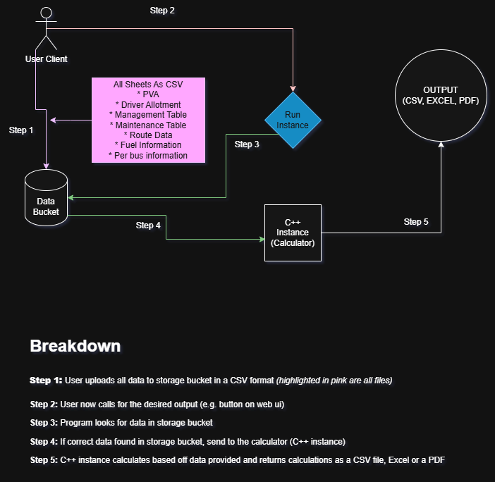

# Contractor Calculator C++ Instance

Converting the Python instance to C++ for performance and efficiency



### What's been done
* \# years since calculations
* Driver payment calculations
* CSV file reading in
* PVA table calculations
* Reading in daily bus route data (formatting is **not** correct)
* Maintenance table calculations
* Management table calculations (regular/special bus evaluations included)

### What's left to do?
* Fuel cost calculations
* Overall calculations
* Totaling of values
* Code cleanup
* AWS deploy?
* Dockerize instances
* Safety checks
* Data output
* Data input (other than manual feed)


### Data Input
Entrypoint: `/Data`

| Filename                        | Data                                               |
|---------------------------------|----------------------------------------------------|
| `Driver Payment Scale.csv`      | Driver Hourly Pay Scale per Years Worked           |
| `PVA Table.csv`                 | PVA table (row count x approval year)              |
| `Daily Bus Routes.csv`          | Daily bus routes, times, distance, and #           |
| `Maintenance Payment Scale.csv` | Cost per mile x # of rows                          | 
| `Management Payment Scale.csv`  | approval date -> flat fee *note unique formatting* |


### Calculation Functions
All calculation functions can be found under `/calculations.h` and defined returning a `double` data type
```c++
#pragma once

#include <iostream>
#include <string>
#include <map>
#include <ctime>
#include <sstream>
#include <iomanip>

#include "utils.h"

// Calculates payment based on years of experience and scale
/**
 * Calculates driver payment based on their years of experience.
 *
 * @param driver_start_date The date when the driver started working (format: YYYY-MM-DD).
 * @param payment_scale A map containing the payment scales for different years of experience.
 *                       Each key in the map should be a string representing the year range
 *                       or a single year, and each value is the corresponding payment rate.
 *
 * @return The calculated driver payment based on their years of experience and the provided payment scale.
 */
inline double driver_payment_calculations(
    const std::string& driver_start_date,
    const std::map<std::string, double>& payment_scale)
{
    // Calculate the number of full years since the given date
    const int years = years_since(driver_start_date);

    if (years < 0) {
        return 0.0; // Invalid date or parsing error
    }

    for (const auto& [key, rate] : payment_scale) {
        // Check if the key contains a range (e.g., "5-10") and is in the correct format
        if (key.find('-') != std::string::npos) {
            // Use strtol to safely convert the lower bound from string to long int
            const char* key_cstr = key.c_str();
            char* end1;
            const long lower_bound = std::strtol(key_cstr, &end1, 10);

            if (*end1 == '-') {
                char* end2;
                // Use strtol to safely convert the upper bound from string to long int
                const long upper_bound = std::strtol(end1 + 1, &end2, 10);

                // Check if the calculated years fall within the specified range and return the corresponding payment rate
                if (*end2 == '\0' && years >= lower_bound && years <= upper_bound) {
                    return rate;
                }
            }

        } else if (key.find('+') != std::string::npos) {
            // Check if the key contains a single year in the correct format and is greater than or equal to the calculated years
            std::string lower_str = key.substr(0, key.find('+'));
            char* end;

            // Check if the calculated years are greater than or equal to the single year and return the corresponding payment rate
            if (const long lower_bound = std::strtol(lower_str.c_str(), &end, 10); *end == '\0' && years >= lower_bound) {
                return rate;
            }
        }
    }

    // If no matching key is found in the payment scale, return a default value (0.0)
    return 0.0;
}

inline double maintenance_calculations(
    const int& row_count,
    const std::map<std::string, double>& payment_scale)
{
    // Calculate the number of full years since the given date

    if (row_count < 0) {
        return 0.0; // Invalid date or parsing error
    }

    for (const auto& [key, rate] : payment_scale) {
        // Check if the key contains a range (e.g., "5-10") and is in the correct format
        if (key.find('-') != std::string::npos) {
            // Use strtol to safely convert the lower bound from string to long int
            const char* key_cstr = key.c_str();
            char* end1;
            const long lower_bound = std::strtol(key_cstr, &end1, 10);

            if (*end1 == '-') {
                char* end2;
                // Use strtol to safely convert the upper bound from string to long int

                // Check if the calculated row_count fall within the specified range and return the corresponding payment rate
                if (const long upper_bound = std::strtol(end1 + 1, &end2, 10); *end2 == '\0' && row_count >= lower_bound && row_count <= upper_bound) {
                    return rate;
                }
            }

        } else if (key.find('+') != std::string::npos) {
            // Check if the key contains a single year in the correct format and is greater than or equal to the calculated years
            std::string lower_str = key.substr(0, key.find('+'));
            char* end;

            // Check if the calculated years are greater than or equal to the single year and return the corresponding payment rate
            if (const long lower_bound = std::strtol(lower_str.c_str(), &end, 10); *end == '\0' && row_count >= lower_bound) {
                return rate;
            }
        }
    }

    // If no matching key is found in the payment scale, return a default value (0.0)
    return 0.0;
}

inline double pva_calculations(const std::vector<std::vector<std::string>>& table, const std::string& year, const int& row_count) {
    int col_idx = 0;
    int row_idx = 0;

    for (col_idx=0; col_idx < table[0].size(); col_idx++) {
        if (std::to_string(row_count) == table[0][col_idx]) break;
    }

    for (row_idx=0; row_idx < table.size(); row_idx++) {
        if (table[row_idx][0] == year) break;
    }

    return std::stod(table[row_idx][col_idx]);
}


struct bus_metrics {
    std::string name;
    double distance{};
    double time_driven{};
};


// TODO: absolutely cooked redo ALL OF THIS
inline std::vector<bus_metrics> bus_metrics_combined(const std::vector<std::string>& data) {
    std::vector<bus_metrics> result;
    bus_metrics current;
    bool has_data = false;

    for (size_t i = 0; i < data.size();) {
        std::cout << "[DEBUG] " << data[i] << \
            " Name: " << current.name << \
                " Distance: " << current.distance << \
                    " Time: " << current.time_driven << std::endl;

        if (data[i] == "VehicleNumber:") {
            if (has_data) {
                result.push_back(current);
                has_data = false;
            }

            // Defensive: check bounds
            if (i + 1 < data.size()) {
                current = {};
                current.name = data[i + 1];
                i += 2;
            } else {
                break; // malformed data
            }
        } else {
            if (i + 6 <= data.size()) {
                const std::string& start_time = data[i + 2];
                const std::string& end_time = data[i + 3];
                const double distance = std::stod(data[i + 4]);

                current.time_driven += time_difference_minutes(end_time, start_time);
                current.distance += distance;
                has_data = true;

                i += 6; // Move to next record
            } else {
                break; // incomplete record
            }
        }
    }

    if (has_data) {
        result.push_back(current);
    }

    return result;
}


inline double management_calculations(const std::map<std::string, double>& scale, const std::string& bus_approval_date, const std::string& category = "") {
        const std::chrono::sys_days date = parse_yyyy_mm_dd(bus_approval_date);

        for (const auto& entry : scale) {
            const std::string& key = entry.first;
            const double& value = entry.second;

            if (key.find('-') != std::string::npos) {
                const std::size_t pos = key.find('-');
                std::string start_str = key.substr(0, pos);
                std::string end_str = key.substr(pos + 1);
                std::chrono::sys_days start_date = parse_ddMMyyyy(start_str);

                if (std::chrono::sys_days end_date = parse_ddMMyyyy(end_str); date >= start_date && date <= end_date) {
                    return value;
                }
            }
            else if (key.starts_with("<")) {
                if (std::chrono::sys_days cutoff_date = parse_ddMMyyyy(key.substr(1)); date < cutoff_date) {
                    return value;
                }
            }
            else if (key.starts_with(">")) {
                if (const std::chrono::sys_days cutoff_date = parse_ddMMyyyy(key.substr(1)); date > cutoff_date) {
                    return value;
                }
            }
            else if (key.starts_with(category + ">")) {
                if (const std::chrono::sys_days cutoff_date = parse_ddMMyyyy(key.substr(category.size() + 1)); date > cutoff_date) {
                    return value;
                }
            }
        }

        return -1.00; // No match
}
```